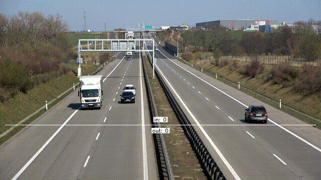

# YOLOv8 CrossZone Counter

YOLOv8 CrossZone Counter is a video object counting project based on YOLOv8 and Supervision.

This repository supports two video counting scenarios:

1. Line crossing counting
2. Polygon zone counting

The pipeline uses YOLOv8 for object detection, ByteTrack for object tracking in line crossing counting, and Supervision for line and polygon zone visualization.


## Demo



[Watch full result video](outputs/vehicle_line/vehicles_result_Line_Cross_Counting_ShortLine.mp4)

## Features

* YOLOv8-based object detection
* ByteTrack-based object tracking
* Line crossing counting
* Polygon zone counting
* First-frame extraction for zone configuration
* Local video input and output management

## Project Structure

```text
.
├── src/
│   ├── count_line_crossing.py
│   ├── count_polygon_zone.py
│   └── extract_first_frame.py
├── assets/
│   └── mall_first_frame.jpg
├── data/
│   └── .gitkeep
├── outputs/
│   └── .gitkeep
├── requirements.txt
├── .gitignore
└── README.md
```

## Dataset

Large video files are not included in this repository.

Place input videos under `data/raw/`.

Expected local files:

```text
data/raw/mall.mp4
data/raw/SampleVideo.mp4
data/raw/vehicles_Line_Cross_Counting.mp4
```

## Model Weights

YOLO model weight files are not included in this repository.

Place model weights under `weights/`.

Expected local file:

```text
weights/yolov8s.pt
```

## Installation

```bash
pip install -r requirements.txt
```

## Usage

### 1. Mall Polygon Zone Counting

```bash
python src/count_polygon_zone.py \
  --source data/raw/mall.mp4 \
  --output outputs/mall_polygon/mall_polygon_yolov8.mp4 \
  --model weights/yolov8s.pt \
  --classes person \
  --polygon 1310 2142 1906 1270 2374 1258 3494 2150 \
  --output-width 1920 \
  --output-height 1080 \
  --imgsz 1280
```

### 2. Sample Video Line Crossing Counting

```bash
python src/count_line_crossing.py \
  --source data/raw/SampleVideo.mp4 \
  --output outputs/sample_line/sample_line_yolov8.mp4 \
  --model weights/yolov8s.pt \
  --classes car motorcycle bus truck \
  --line 200 540 1700 540 \
  --imgsz 1280
```

### 3. Vehicle Line Crossing Counting

```bash
python src/count_line_crossing.py \
  --source data/raw/vehicles_Line_Cross_Counting.mp4 \
  --output outputs/vehicle_line/vehicle_line_yolov8.mp4 \
  --model weights/yolov8s.pt \
  --classes car motorcycle bus truck \
  --line 0 1500 3840 1500 \
  --imgsz 1280
```

## Example Tasks

| Video                              | Counting Method        | Target Classes              |
| ---------------------------------- | ---------------------- | --------------------------- |
| `mall.mp4`                         | Polygon zone counting  | person                      |
| `SampleVideo.mp4`                  | Line crossing counting | car, motorcycle, bus, truck |
| `vehicles_Line_Cross_Counting.mp4` | Line crossing counting | car, motorcycle, bus, truck |

## Notes

* Input videos are excluded from Git tracking.
* Output videos are excluded from Git tracking.
* Model weights are excluded from Git tracking.
* Use `extract_first_frame.py` to extract a reference frame before setting line or polygon coordinates.
* The line and polygon coordinates may need to be adjusted depending on the input video resolution.

